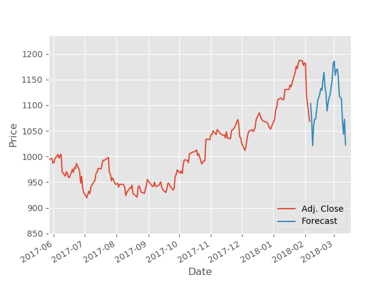

#Overview
In this project, a model that can predict the price of google stock using the Linear Regression Algorithm was built. It achieved over 98% accuracy.

The dataset that was used for this project was from August 2004 to March 2018, and was acquired from [Quandl](https://www.quandl.com/).

At the end of training and testing set, the model was asked to forecast future stock prices and below is a visualization of the forecast:

#Dependencies
* Numpy
* Pandas
* Matplotlib
* Pickle
* Scikit-Learn

#Usage
1. `cd 'Predicting Google Stock Prices Using Linear Regression Algorithm' `
1. `python model.py`

#Credit
* [Sentdex](https://www.youtube.com/channel/UCfzlCWGWYyIQ0aLC5w48gBQ)
* [Quandl](https://www.quandl.com/)
